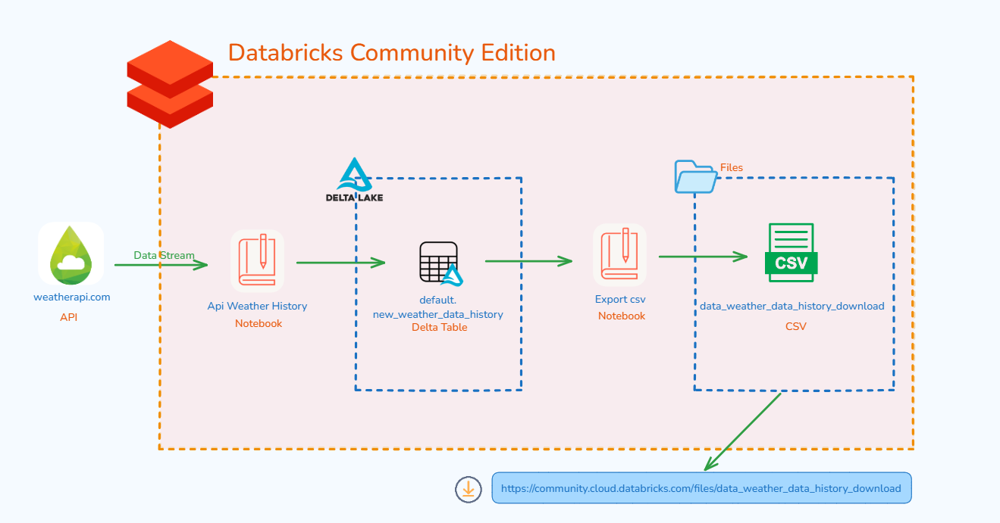
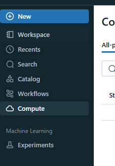
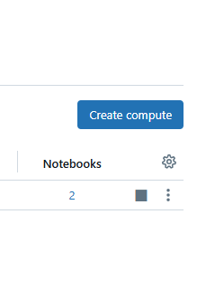
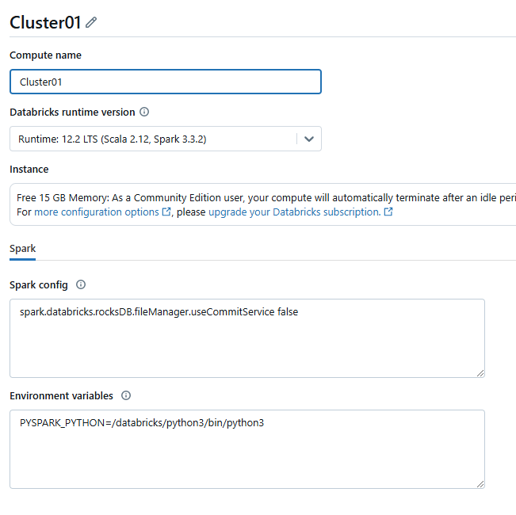
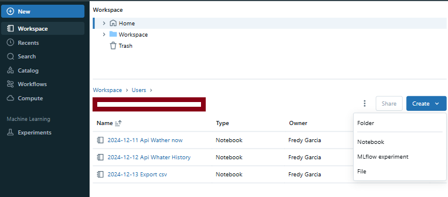

# Databricks Community Edition - Api Table Delta and Export CSV

Use this environment to practice and develop personal projects.


## Create Account and Notebooks

### Step 01

Creating account in databricks Community in link :

* [Link databricks Community](https://community.cloud.databricks.com/login.html?tuuid=799e5e7c-b1fc-49e8-869c-283e52d38c8e)


### Step 02

Creating Cluster of Computing

* Select option "Compute"

    

* Select option "Create compute"

    

* Define Name Cluster

    


### Step 03

* In Workspace create Notebook

    


## Create process Load Api Table

Example :

Creating account in :

https://www.weatherapi.com/

use the key that the website will give you

``` python
key = "xxxxxxxxxxxxxxxxxxxxxxxxxxxxxxxxxxxxxx"
# URL de la API (reemplaza con tu clave y parámetros)
api_url = "https://api.weatherapi.com/v1/history.json?q=Lima&dt="+current_date_iso+"&end_dt="+current_date_iso+"&key="+key

# Llama a la API
response = requests.get(api_url)
if response.status_code == 200:
    weather_data_Lima = response.json()
else:
    raise Exception(f"Error en la API: {response.status_code}")

```

* File complete : [All_Script_Load](/2024-12-12%20Api%20Whater%20History.ipynb)


## Export CSV

Creating file in "dbfs:/FileStore"

``` python
df_Export.coalesce(1) \
    .write.format("com.databricks.spark.csv") \
    .mode("overwrite") \
    .option("header", "true") \
    .option("delimiter", "|") \
    .option("compression", "gzip") \
    .save("dbfs:/FileStore/data_weather_data_history")
```

Transform Content:
``` python
list_of_files = dbutils.fs.ls("dbfs:/FileStore/data_weather_data_history")
for item in list_of_files:
  if item.name.startswith("part"):
    csv_part_file = item.path
    
dbutils.fs.mv(csv_part_file, "dbfs:/FileStore/data_weather_data_history_download", True)
dbutils.fs.rm("dbfs:/FileStore/data_weather_data_history", True)
```

* File complete: [All_Script_Export](/2024-12-13%20Export%20csv.ipynb)


in other page paste:

* [https://community.cloud.databricks.com/files/data_weather_data_history_download](https://community.cloud.databricks.com/files/data_weather_data_history_download)


to the file add the .gz extension, then unzip it and add the .csv extension to the content